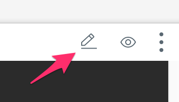
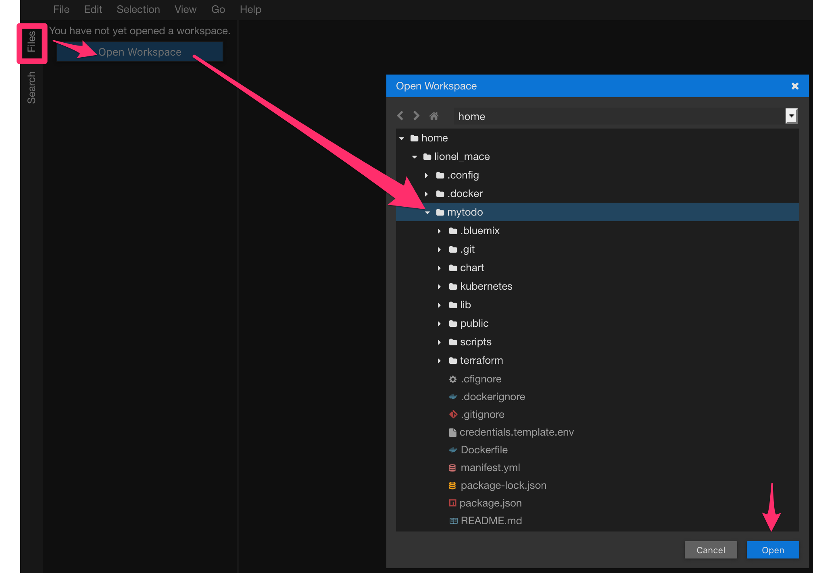
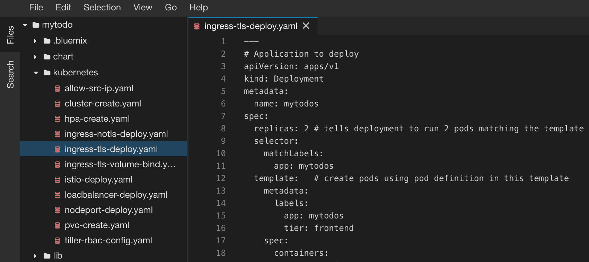

# Deploy the app using Kubernetes Services and Deployments

Different ways exist to make your app accessible from the internet. To choose the best networking option for your application, you can follow the decision tree available [here](https://cloud.ibm.com/docs/containers/cs_network_planning.html#planning).

In this lab, we will test the **Ingress**.

## Deploy with Ingress

1. Navigate to the folder **kubernetes**.
    ```sh
    cd kubernetes
    ```

1. Let's use the online web editor to modify the deployment file. Click the pen on the top right corner

    

1. Open the project **mytodos** you cloned before. Select Files on the left hand side, then Open Workspace and search for the downloaded project

    

    

1. Select the file `ingress-tls-deploy.yaml` .

1. Replace all the values wrapped in <> with the appropriate values.
    * <region> would be `eu-de` for Frankfurt (3 changes)
    * <namespace> would be the private registry `lab_registry` (1 change)
    * todo-<lastname> to have a unique docker image name (1 change)
    * <cluster-name> would be `lab-cluster-1` (3 changes).

    Your YAML file should look as follows:
    ```yaml
    ---
    # Application to deploy
    apiVersion: apps/v1
    kind: Deployment
    metadata:
      name: mytodos
    spec:
      replicas: 2 # tells deployment to run 2 pods matching the template
      selector:
        matchLabels:
          app: mytodos
      template:   # create pods using pod definition in this template
        metadata:
          labels:
            app: mytodos
            tier: frontend
        spec:
          containers:
          - name: mytodos
            image: registry.<region>.bluemix.net/<namespace>/todo-<lastname>:1.0
            imagePullPolicy: Always
            resources:
              requests:
                cpu: 250m     # 250 millicores = 1/4 core
                memory: 128Mi # 128 MB
              limits:
                cpu: 500m
                memory: 384Mi
            # envFrom:
            # - secretRef:
            #     name: database-credentials
    ---
    apiVersion: extensions/v1beta1
    kind: Ingress
    metadata:
      name: mytodos-ingress
      annotations:
        ingress.bluemix.net/rewrite-path: "serviceName=mytodos rewrite=/"
        # Force the use of https if the request is http
        ingress.bluemix.net/redirect-to-https: "True"
    spec:
      tls:
      - hosts:
        - <cluster-name>.<region>.containers.appdomain.cloud
        secretName: <cluster-name>
      rules:
      - host: <cluster-name>.<region>.containers.appdomain.cloud
        http:
          paths:
          - path: /todo/
            backend:
              serviceName: mytodos
              servicePort: 8080
    ---
    # Service to expose frontend
    apiVersion: v1
    kind: Service
    metadata:
      name: mytodos
      labels:
        app: mytodos
        tier: frontend
    spec:
      ports:
      - protocol: TCP
        port: 8080
      selector:
        app: mytodos
        tier: frontend
    ```

1. Deploy the app into your Kubernetes cluster.
    ```sh
    kubectl apply -f ingress-tls-deploy.yaml
    ```
    Result:
    ```
    deployment.apps/mytodos created
    ingress.extensions/mytodos-ingress created
    service/mytodos created   
    ```

1. Open a browser and check out the app with the following URL:
    ```
    https://<cluster-name>.eu-de.containers.appdomain.cloud/todo/
    ```
    In this example, the url would be ```https://lab-cluster-1.eu-de.containers.appdomain.cloud/todo/```