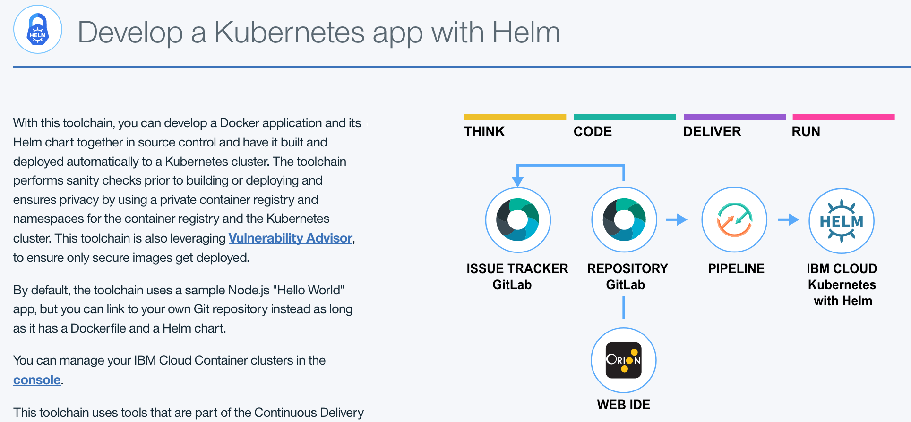
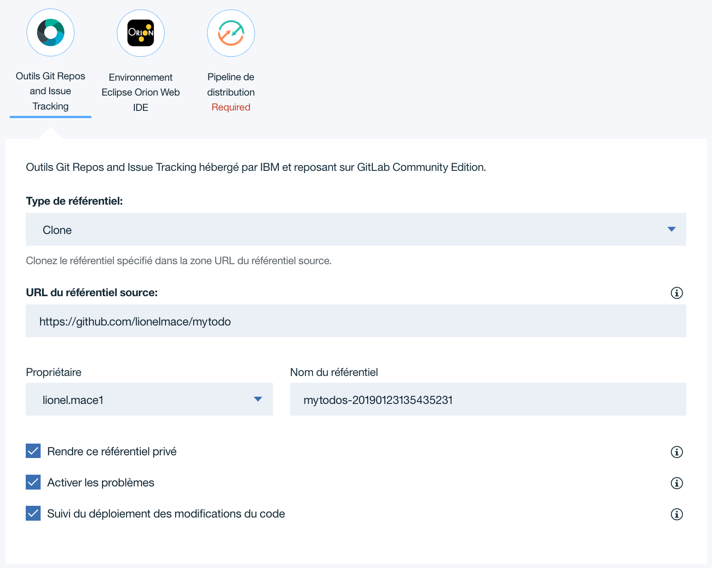
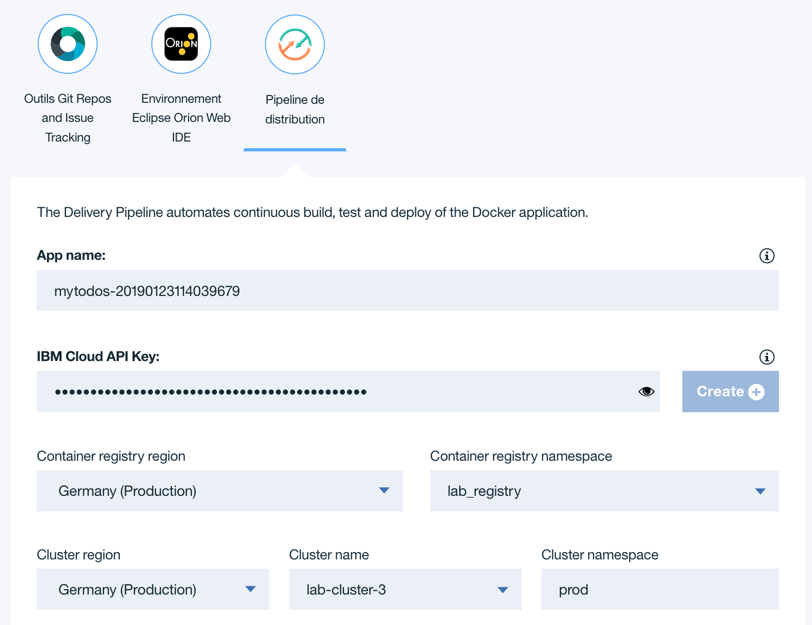
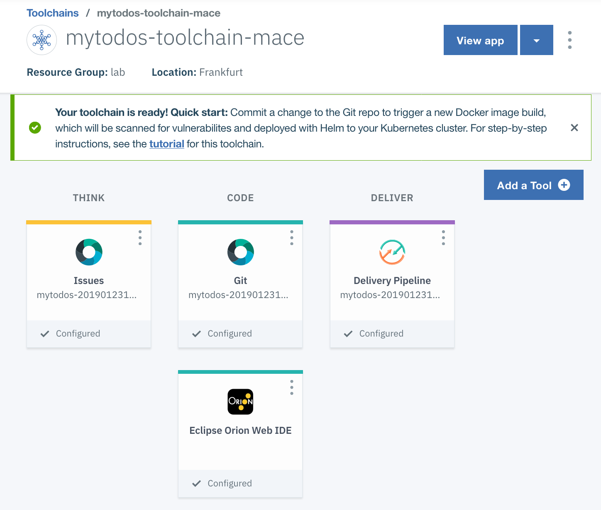
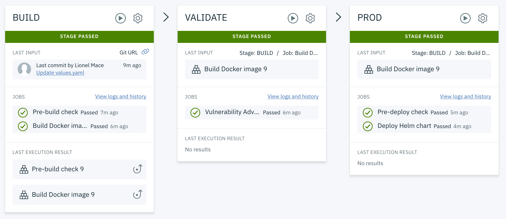

## Deploy using a Continuous Delivery Pipeline

In this tutorial, you create an open toolchain and use it to deploy the web app, package it into a Docker container, and then deploy the app to a Kubernetes cluster using Helm charts.

IBM Cloud Continuous Delivery supports Helm functions in the Delivery Pipeline. 

The toolchain used for this tutorial is configured out of the box to perform sanity checks before build or deploy activities, and manages development privacy by using a private image registry and configurable namespaces (both in the container registry and Kubernetes cluster).

The toolchain includes:

* Git Repos and Issue Tracking for source control and issue tracking.
* Eclipse Orion Web IDE for online editing.
* Vulnerability Advisor to ensure the container we're deploying is secure.
* Deployment to IBM Cloud Kubernetes with Helm.

# Create a Toolchain

1. Open the creation page for the toolchain by clicking **[Create toolchain](https://cloud.ibm.com/devops/setup/deploy?repository=https://github.com/lionelmace/mytodo&branch=master)**

1. The diagram of the toolchain shows each tool integration in its lifecycle phase in the toolchain.

    

1. Review the default information for the toolchain settings. Select the region **Frankfurt** and the Resource Group **lab**.

    

1. Keep the default options for the git configuration. This should like the following:

    

1. Click Delivery Pipeline.

    

    * **App name**: Enter the name for your application. The app name must be unique (if you want, you can just use the default value provided).

    * **Container Registry Region**: Select the region you want the docker images to be created into.

    * **Container Registry Namespace**: This is your folder in the global image registry in a region, used to manage your own set of images. It must be a unique name.

    * **IBM Cloud API Key**: Create a new IBM Cloud API Key.

    * **Cluster Region**: Select the region for the target cluster. 

    * **Cluster Name**: The name of the Kubernetes  cluster that you got assigned. Exemple: `lab-cluster-1`

    * **Cluster Namespace**: It is a best practice to use explicit namespaces in clusters to separate deployed resources. For instance, we use ‘prod’ to denote a prod environment within this cluster. Later in the tutorial, we will add a ‘staging’ environment within the same cluster. You can leave this setting at its default 'prod' value.

1. Click **Create**. After a few moments, your new toolchain's Overview page opens.

    

# Explore Delivery Pipeline in your toolchain

Explore Delivery Pipeline in your toolchain. The pipeline is automatically triggered on every Git commit push.

A delivery pipeline automates the continuous deployment of a project. In a project's pipeline, sequences of stages retrieve input and run jobs, such as builds, tests, and deployments. You can use a pipeline to facilitate everything that is required for a DevOps project.

1. On the toolchain's Overview page, click **Delivery Pipeline** to see your toolchain as it is being built and deployed. Your pipeline might still be running.

    

1. Review the BUILD stage. On the BUILD stage, click the Configure Stage icon to explore the stage.

    * The **Pre-build check** job checks for mandatory files (the Dockerfile and Helm chart), lints the files, and creates the image registry namespace.

    * The **Build Docker image** job creates the Docker image by using the IBM Cloud Container Registry build service through the bx cr build CLI script. The script stores the output image into the private IBM Cloud Container Registry and copies the Helm chart and other app scripts with the build results into the ARCHIVE_DIR folder.

    * The build scripts also record a few environment variables into a build.properties file.

1. Click **CANCEL** to return to the pipeline.

1. On the BUILD stage, click **View logs and history**. Notice that the stage is building the container and copying the Kubernetes deploy manifest file into build artifacts.

1. On the pipeline's log page, click the **Back** arrow to return to the pipeline page.

1. On the VALIDATE stage, click the **Configure Stage** icon to explore the stage.

    * This toolchain prevents you from deploying unsafe Docker images using IBM Cloud Vulnerability Advisor. This is performed by the pipeline job Vulnerability Advisor which runs the container registry command bx cr va ${PIPELINE_IMAGE_URL}. Notice how the VALIDATE stage is configured to receives the build.properties file from the build result, which will automatically recreate the respective environment properties.

    * When security issues are discovered, a report will be printed in the job log.

    * The **Use the container image from the stage input** check box is selected.

    * The VALIDATE stage is configured to be advisory so that if it fails, it does not block the pipeline. You can change this behavior by selecting the **Stop running this stage if this job fails** check box. 

1. Click **CANCEL** to return to the pipeline.

1. On the VALIDATE stage, click **View logs and history**. This stage runs the Vulnerability Advisor on the image to check for known vulnerabilities. If it finds a vulnerability, the stage fails, preventing the image from being deployed. This safety feature prevents apps with security holes from being deployed. The image has no vulnerabilities, so it passes.

1. On the pipeline's log page, click the **Back** arrow to return to the pipeline page.

1. On the PROD stage, click the **Configure Stage** icon to explore the stage.

    * The "Pre-deploy check" job checks for cluster readiness and namespace existence, configures the cluster namespace, grants access to the private image registry, configures tiller, and checks the Helm releases in the namespace.

    * The "Deploy Helm chart" job sets environment variables and deploys the Helm chart into the Kubernetes cluster.

1. Click **CANCEL** to return to the pipeline.

1. On the PROD stage, click **View logs and history** and then click the **Deploy Helm chart** job. This job deploys the app into the Kubernetes cluster. At the end of the log file, find the link to the running application.

    

1. Browse to the given url to see the running application. The url should look similar to this https://todo.lab-cluster-2.eu-de.containers.appdomain.cloud/.