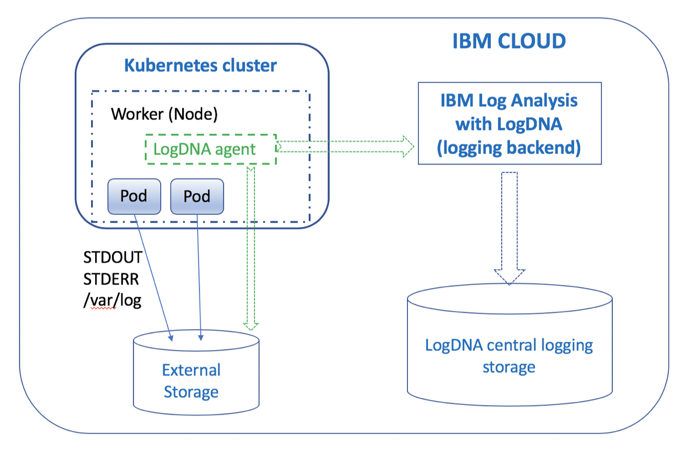
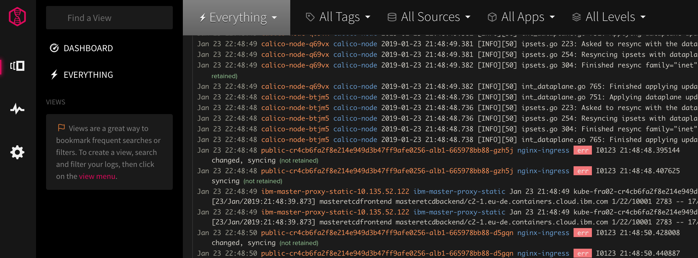

# Logging with LogDNA

IBM Log Analysis with LogDNA is a third-party service that you can include as part of your IBM Cloud architecture to add log management capabilities. IBM Log Analysis with LogDNA is operated by LogDNA in partnership with IBM.

On the IBM Cloud, to configure cluster-level logging for a Kubernetes cluster, you must provision an instance of the IBM Log Analysis with LogDNA service.



## Provision an instance of Log Analysis with LogDNA service

1. Navigate to the [**Observability**](https://cloud.ibm.com/observe) page

    

1. Under **Logging**, click **Create instance**.

1. Provide a unique **Service name** such as `logdna-<lastname>`.

1. Choose a **region/location** and select a **resource group**.

    

    > To better govern your services, it is recommended to use the same Resource Group than the one your cluster is in.

1. Select **Lite** as your plan and click **Create**.

    

1. The Observability dashboard opens and shows the details for your service.

## Configure the cluster to send logs to your LogDNA instance.

To configure your Kubernetes cluster to send logs to your IBM Log Analysis with LogDNA instance, you must install a `logdna-agent` pod on each node of your cluster. The LogDNA agent reads log files from the pod where it is installed, and forwards the log data to your LogDNA instance.

1. Click on **Edit log sources** next to the service which you created earlier.

    

1. Select **Kubernetes**.

    

1. Copy and run the first command on a terminal where you have set the KUBECONFIG environment variable to create a kubernetes secret with the LogDNA ingestion key for your service instance.

    In this step, you create a Kubernetes secret to store your logDNA ingestion key for your service instance. The LogDNA ingestion key is used to open a secure web socket to the logDNA ingestion server and to authenticate the logging agent with the logging service.

1. Copy and run the second command to create a Kubernetes daemon set to deploy the LogDNA agent on every worker node of your Kubernetes cluster.

    The LogDNA agent collects logs with the extension *.log and extensionless files that are stored in the /var/log directory of your pod. By default, logs are collected from all namespaces, including kube-system, and automatically forwarded to the IBM Log Analysis with LogDNA service.

1. Verify that the LogDNA agent is deployed successfully.
    ```sh
    kubectl get pods
    ```
    Output:

    

    The deployment is successful when you see one or more LogDNA pods. The number of LogDNA pods equals the number of worker nodes in your cluster. All pods must be in a Running state.

1. To check that the secret containing the access key has been created, you can run the following command:
    ```sh
    kubectl get secrets
    ```


## View logs in the LogDNA dashboard

1. After you configure a log source, launch the LogDNA UI by clicking **View LogDNA**. It may take a few minutes before you start seeing logs.

1. Since namespace is a field that LogDNA collects, you can use the search function to filter your namespace. Use `namespace:name` to view only the logs of the applications deployed to the specified namespace.

    > Note: With the Free service plan, you can tail your latest logs only.

1. If your app is still running you can create a new todo with the Web UI or using curl
    ```
    curl -d '{"text":"newlog"}' -H "Content-Type: application/json" -X POST https://<cluster-name>.<region>.containers.appdomain.cloud/todo/api/todos
    ```

1. As you go through the next steps, keep an eye on the LogDNA console for new log statements coming from your apps deployed in this namespace.

    

## Resources

For additional resources pay close attention to the following:

* More about IBM Log Analysis with LogDNA in the [IBM Cloud documentation](https://cloud.ibm.com/docs/services/Log-Analysis-with-LogDNA/index.html#getting-started).